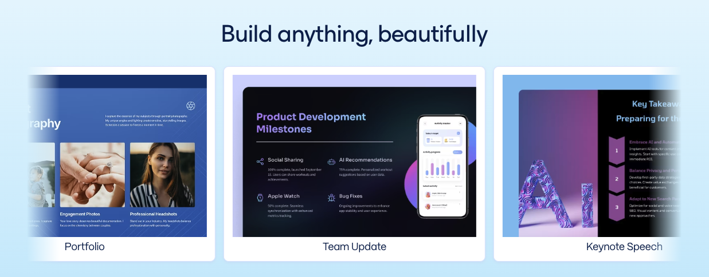

# Introduction to Gamma's API offerings

<figure><figcaption></figcaption></figure>

## What is Gamma?

[Gamma](https://gamma.app/about) is an AI-powered design partner that helps you create professional-looking presentations, documents, social posts, and websites quickly using AI-generated content and images. Our APIs extends this functionality to developers and users of automation tools, allowing them to integrate Gamma’s content generation capabilities into their own applications and workflows.


**Current API Limitations:**

* **Creation only** — You cannot edit existing Gammas via API. Use the returned `gammaUrl` to edit in the web app.
* **No file uploads** — The API accepts text input only. You cannot upload files (PDFs, PPTX, images, etc.) directly. To include images, provide publicly accessible URLs in your `inputText`.
* **One language per output** — Each request generates content in a single language.
* **One export format per request** — Choose PDF _or_ PPTX, not both.


## Asynchronous Generation & Polling

Generation requests are asynchronous. When you send a request to create a Gamma (via `POST /generations` or `POST /generations/from-template`), the API returns a `generationId` immediately. The generation process happens in the background.To get the result, you must **poll** the status endpoint:

1. **Initiate Generation**: Call the generation endpoint. You receive a `generationId`.
2. **Poll Status**: Repeatedly call `GET /generations/{id}` with your `generationId`.
   * We recommend a polling interval of **\~5 seconds**.
3. **Check Status**:
   * `pending`: The generation is still in progress. Wait and poll again.
   * `completed`: The generation is finished. The response will include `gammaUrl` (link to the editable Gamma) and `exportUrl` (if you requested a PDF/PPTX export).
   * `failed`: The generation failed. Check the error message.

## Key Features 

<table data-view="cards"><thead><tr><th></th><th></th><th></th></tr></thead><tbody><tr><td><h2><i class="fa-file-image">:file-image:</i></h2></td><td><h4>Versatile Content Creation</h4></td><td>Create presentations, documents, social posts, and websites in various sizes and styles. Generate from any text — a one-line prompt, messy notes, or polished content. Support for 60+ languages makes your content globally accessible.</td></tr><tr><td><h2><i class="fa-wand-magic-sparkles">:wand-magic-sparkles:</i></h2></td><td><h4>Intelligent Design</h4></td><td>Get thoughtfully designed content with customizable themes and images from AI or a source of your choosing. Fine-tune your output by defining tone, audience, and detail level.</td></tr><tr><td><h2><i class="fa-file-pdf">:file-pdf:</i></h2></td><td><h4>Seamless Workflow</h4></td><td>Further refine your API generated content in the Gamma app or export directly to PDF or PPTX via API. You can also connect Gamma into your favorite automation tool to create an end to end workflow.</td></tr></tbody></table>

## Ways to use the API

You can use the Gamma API in multiple ways:

* On automation platforms like [Make](https://www.make.com/en/integrations/gamma-app), [Zapier](https://zapier.com/apps/gamma/integrations), Workato, N8N, etc, to automate your workflows
* By directly integrating it into backend code to power your apps




<figure><figcaption></figcaption></figure>





<figure><figcaption></figcaption></figure>




## Authentication

We currently support authentication via API keys only; OAuth support is coming soon.
