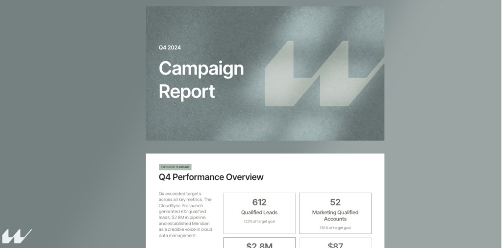

# Gamma Developer Documentation



One API call. Polished presentations, documents, websites, and social posts — branded, exported, and shared.

<a href="https://gamma.app/settings/api-keys" class="button primary">Get your API key</a><a href="overview/understanding-the-api-options.md" class="button secondary">API overview</a>



<figure><figcaption></figcaption></figure>



## Quickstart

Authenticate with your API key via the `X-API-KEY` header. API key access requires a Pro, Ultra, Teams, or Business plan. [ChatGPT and Claude connectors](overview/connectors-and-integrations.md) work on all plans.



```bash
curl -X POST https://public-api.gamma.app/v1.0/generations \
  -H "Content-Type: application/json" \
  -H "X-API-KEY: $GAMMA_API_KEY" \
  -d '{
    "inputText": "Q3 product launch strategy",
    "textMode": "generate",
    "format": "presentation",
    "numCards": 10,
    "exportAs": "pdf"
  }'
```



```python
import requests, os

response = requests.post(
    "https://public-api.gamma.app/v1.0/generations",
    headers={
        "X-API-KEY": os.environ["GAMMA_API_KEY"],
        "Content-Type": "application/json",
    },
    json={
        "inputText": "Q3 product launch strategy",
        "textMode": "generate",
        "format": "presentation",
        "numCards": 10,
        "exportAs": "pdf",
    },
)
generation_id = response.json()["generationId"]
```



```javascript
const response = await fetch(
  "https://public-api.gamma.app/v1.0/generations",
  {
    method: "POST",
    headers: {
      "Content-Type": "application/json",
      "X-API-KEY": process.env.GAMMA_API_KEY,
    },
    body: JSON.stringify({
      inputText: "Q3 product launch strategy",
      textMode: "generate",
      format: "presentation",
      numCards: 10,
      exportAs: "pdf",
    }),
  }
);
const { generationId } = await response.json();
```



```json
{ "generationId": "abc123xyz" }
```

Poll `GET /v1.0/generations/{generationId}` every 5 seconds until `status` is `completed` or `failed`. Full polling examples in [Async Patterns and Polling](overview/async-patterns-and-polling.md).

```json
{
  "status": "completed",
  "gammaUrl": "https://gamma.app/docs/abc123",
  "exportUrl": "https://gamma.app/export/abc123.pdf",
  "credits": { "deducted": 15, "remaining": 485 }
}
```



Your presentation is live at `gammaUrl` and the PDF is ready at `exportUrl`.



<div data-with-frame="true"><figure><figcaption></figcaption></figure></div>




Getting a 401? Gamma uses `X-API-KEY` as a custom header — not `Authorization: Bearer`. See [Error codes](errors-and-warnings/error-codes.md) for other common issues.


### Endpoints

| Endpoint | Method | Description |
| --- | --- | --- |
| [/generations](endpoints/create-generation.md) | POST | Generate from text |
| [/generations/{id}](endpoints/get-generation-status.md) | GET | Poll generation status |
| [/generations/from-template](endpoints/create-from-template.md) | POST | Generate from template |
| [/themes](endpoints/list-themes.md) | GET | List workspace themes |
| [/folders](endpoints/list-folders.md) | GET | List workspace folders |
| [/gammas/{gammaId}/archive](endpoints/archive-gamma.md) | POST | Archive a Gamma |


**Building an AI integration?** The [Gamma MCP Server](overview/gamma-mcp-server.md) lets AI tools create gammas on behalf of users via OAuth with Dynamic Client Registration.


### What's new



## Gamma is live on ChatGPT and Claude

Create presentations, documents, and social posts directly from [ChatGPT](overview/connectors-and-integrations.md) and [Claude](overview/connectors-and-integrations.md) — just connect Gamma and start prompting.




## Create from Template GA and new image models

Create from Template is now generally available. Plus new image models including Recraft v4, Gemini 3.1 Flash, and Flux 2.

[Full changelog →](overview/changelog.md)




### Next steps

* [Generate from text](overview/generate-api-parameters-explained.md) — choose format, themes, images, headers/footers, and sharing
* [Generate from a template](overview/create-from-template-api-parameters-explained.md) — design once, generate variations
* [Gamma MCP Server](overview/gamma-mcp-server.md) — connect AI tools to Gamma via MCP
* [Connectors and Integrations](overview/connectors-and-integrations.md) — ChatGPT, Claude, Zapier, Make, n8n
* [Contact sales](https://gamma.app/contact-sales) — enterprise plans and custom integrations
