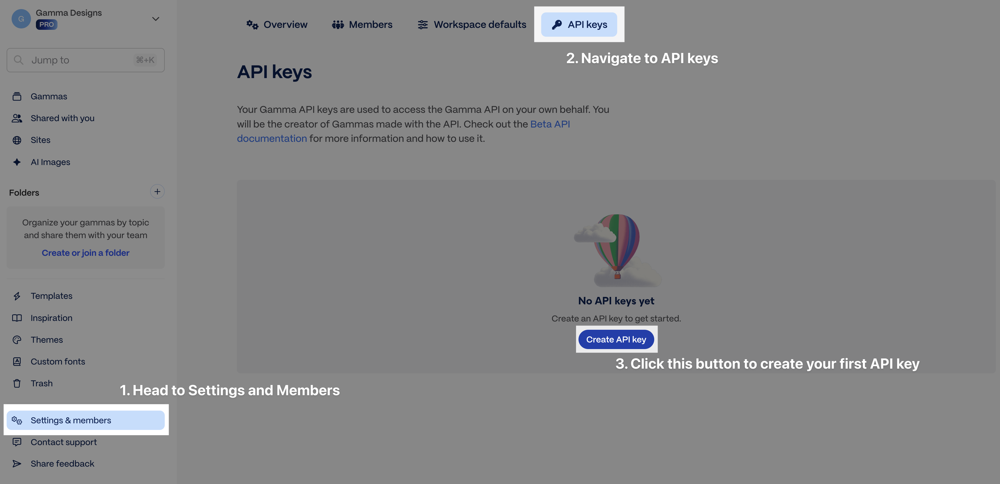

# Access and Pricing

## Quick reference

- ChatGPT and Claude connectors work on all plans.
- API keys are available on Pro, Ultra, Teams, and Business plans.
- Credit usage is returned in the `credits` field on `GET /v1.0/generations/{generationId}`.
- Auto-recharge is the safest way to prevent failed generations due to exhausted credits.

## Access

### API keys (Zapier, Make, n8n, direct integration)

API key access is available on Pro, Ultra, Teams, and Business plans. Generate an API key from your [account settings](https://gamma.app/settings). View [pricing plans here](https://gamma.app/pricing).

<figure><figcaption>
Generate an API key from Settings → API keys
</figcaption></figure>

### Connectors (ChatGPT, Claude)

Connectors are available on all plans, including Free and Plus. No API key required — connect directly from [ChatGPT or Claude](connectors-and-integrations.md) and authenticate with your Gamma account. Generations via connectors charge credits the same way as API calls.

## Usage and pricing

* API billing uses a credit-based system. Higher tier subscribers receive more monthly credits.
* If you run out of credits, you can upgrade to a higher subscription tier, purchase credits ad hoc, or enable auto-recharge (_recommended_) at [gamma.app/settings/billing](https://gamma.app/settings/billing).

<figure><figcaption>
Manage credits and enable auto-recharge from Settings → Billing
</figcaption></figure>

## How credits work

Credit charges are determined based on several factors and are returned in the GET response.

| Feature         | API parameter        | Credits Charged\*                                                                                                                        |
| --------------- | -------------------- | ---------------------------------------------------------------------------------------------------------------------------------------- |
| Number of cards | `numCards`           | 1-5 credits/card                                                                                                                         |
| AI image model  | `imageOptions.model` | Basic models: 2 credits/image. Advanced models: 7-20 credits/image. Premium models: 20-70 credits/image. Ultra models: 30-125 credits/image. |

\* **Credit consumption rates and the actions that consume credits are subject to change.**

Card credit costs vary depending on the AI model used for text generation. Template-based generations (`POST /generations/from-template`) may cost slightly more per card than standard generations.

## Illustrative scenarios

* Deck with 10 cards + 5 images using a basic image model = \~20-60 credits
* Doc with 20 cards + 15 images using a premium image model = \~320-1070 credits
* Socials with 30 cards + 30 images using an ultra image model = \~930-3900 credits

Both standard generations (`POST /generations`) and template-based generations (`POST /generations/from-template`) consume credits. Credit usage details are returned in the `credits` field of the `GET /generations/{generationId}` response, showing `deducted` and `remaining` values.

To learn more about credits, visit our [Help Center](https://help.gamma.app/en/articles/7834324-how-do-ai-credits-work-in-gamma).

## Related

- [Connectors and Integrations](connectors-and-integrations.md) for setup instructions by platform
- [Async Patterns and Polling](async-patterns-and-polling.md) for where `credits.deducted` and `credits.remaining` appear in the generation flow
- [Get Help](get-help.md) if you need support with pricing or API access
