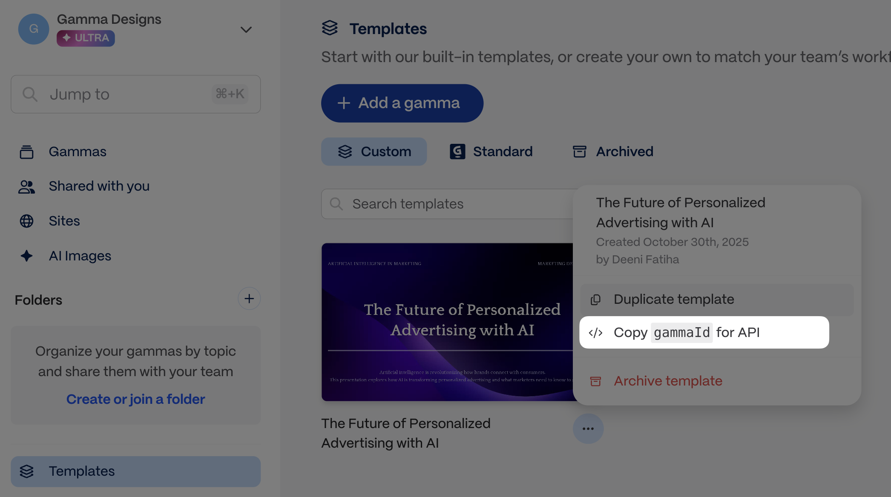
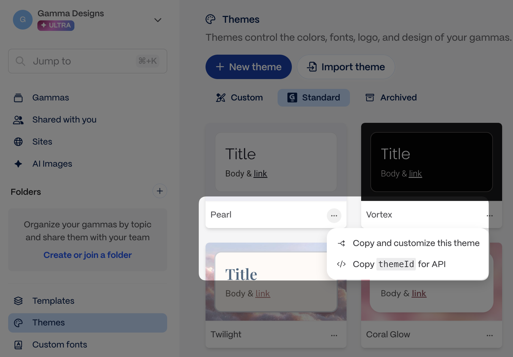
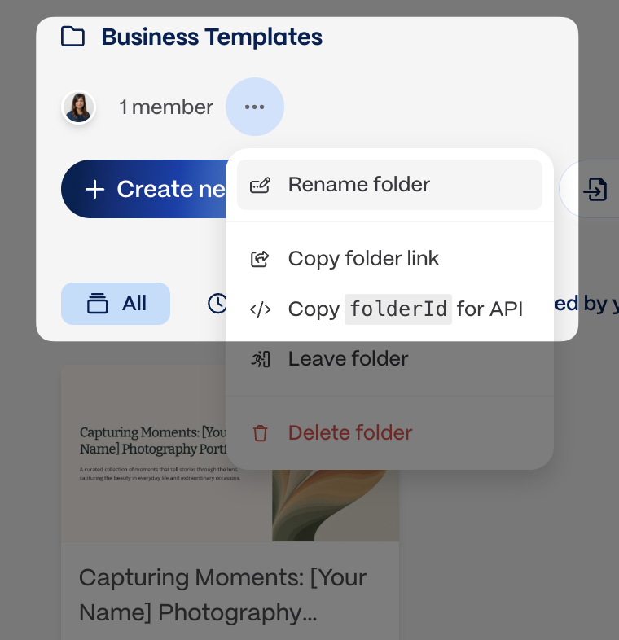

# Generate from template

`POST /v1.0/generations/from-template` adapts, remixes, or transforms an existing Gamma. The template's structure is preserved by default and changes only when your prompt asks. The sections below explain how each parameter shapes the output.


For the exact request body, field types, and polling response schema, see [POST /generations/from-template](../endpoints/create-from-template.md) and [GET /generations/{id}](../endpoints/get-generation-status.md).


### Quick reference

- `gammaId` and `prompt` are required.
- The template Gamma must contain exactly one page.
- Use `themeId`, `folderIds`, `exportAs`, and `sharingOptions` the same way you would in the standard generation flow.
- Poll `GET /v1.0/generations/{generationId}` to retrieve `gammaUrl`, `exportUrl`, and credit usage.

### What you can ask for

The `prompt` parameter is the same instruction surface as the Remix feature in the Gamma app, and it supports a broader set of operations than "fill in the blanks". You can adapt content for a new audience, transform the subject, add or remove cards, lock specific cards, and more.

| Category | Example prompt |
| --- | --- |
| Tailoring to an audience | `Adapt this pitch deck for a healthcare audience, highlighting regulatory compliance, patient safety, and clinical outcomes` |
| Replacing or transforming content | `Using this lesson plan about climate change, create a new one about clean energy` |
| Variables & placeholders | `Replace all instances of [[client-name]] with Acme Corp and update the contact information` |
| Referencing cards | `On card 9, update the pricing information with the new rates` |
| Adding cards | `After the introduction, create three case study cards using the template and content below` |
| Removing cards | `Remove the team bios section and the duplicate intro slide at the start` |
| "Locking" cards | `Do not edit the title card, team bios, or thank you slide — they should stay exactly as written` |
| Images | `Use this logo to replace the placeholder image on the title slide` (include image URLs in your prompt) |
| Populating from data | `Fill out the client overview card using their responses from this intake form` |
| Reordering cards | `Reorder the sections so that "Our Solution" comes before "The Problem" and move the case studies to the end` |

Combine these patterns in a single prompt, or describe the outcome you want and let Gamma figure out the operations. Placeholder tokens like `[[client-name]]` are a convention, not a requirement of the endpoint — any notation works as long as your intent is clear.

### Top-level parameters

#### `gammaId` _(required)_

Identifies the template you want to modify. You can find and copy the gammaId for a template as shown in the screenshots below.



<figure><figcaption><p>Copy the template Gamma ID from the app before you make the request.</p></figcaption></figure>



<figure><figcaption><p>Create from Template works best when the source Gamma has exactly one page.</p></figcaption></figure>



---

#### `prompt` _(required)_

Use this parameter to send text content, image URLs, as well as instructions for how to use this content in relation to the template gamma.

**Add images to the input**

You can provide URLs for specific images you want to include. Simply insert the URLs into your content where you want each image to appear (see example below). You can also add instructions for how to display the images, eg, "Group the last 10 images into a gallery to showcase them together."

**Token limits**

The total token limit is 100,000, which is approximately 400,000 characters, but because part of your input is the gamma template, in practice, the token limit for your prompt becomes shorter. We highly recommend keeping your prompt well below 100,000 tokens and testing out a variety of inputs to get a good sense of what works for your use case.

**Other tips**

* Text can be as little as a few words that describe the topic of the content you want to generate.
* You can also input longer text -- pages of messy notes or highly structured, detailed text.
* You may need to apply JSON escaping to your text. Find out more about JSON escaping and [try it out here](https://www.devtoolsdaily.com/json/escape/).


```json
"prompt": "Change this pitch deck about deep sea exploration into one about space exploration."
```



```json
"prompt": "Change this pitch deck about deep sea exploration into one about space exploration. Use this quote and this image in the title card: That's one small step for man, one giant leap for mankind - Neil Armstrong, https://www.global-aero.com/wp-content/uploads/2020/06/ga-iss.jpg"
```


---

#### `themeId` _(optional, defaults to workspace default theme)_

Defines which theme from Gamma will be used for the output. Themes determine the look and feel of the gamma, including colors and fonts.

* Use [`GET /v1.0/themes`](../endpoints/list-themes.md) to list themes from your workspace, or copy the theme ID directly from the app.

<figure><figcaption><p>Copy the theme ID from the app</p></figcaption></figure>


```json
"themeId": "abc123def456ghi"
```


---

#### `folderIds` _(optional)_

Defines which folder(s) your gamma is stored in.

* Use [`GET /v1.0/folders`](../endpoints/list-folders.md) to list folders, or copy the folder ID directly from the app.
* You must be a member of a folder to add gammas to it.

<figure><figcaption><p>Copy the folder ID from the app</p></figcaption></figure>

```json
"folderIds": ["123abc456def", "456123abcdef"]
```

---

#### `exportAs` _(optional)_

Indicates if you'd like to return the generated gamma as an exported file as well as a Gamma URL.

* Options are `pdf`, `pptx`, or `png`
* Export URLs are signed and expire after approximately one week. Download promptly after generation completes.
* If you do not wish to directly export via the API, you may always do so later via the app.


**One export format per request.** You can export to PDF, PPTX, or PNG, but not multiple formats in a single API call. If you need multiple formats, make separate generation requests or export additional formats manually from the Gamma app.



```json
"exportAs": "pdf"
```


---

#### imageOptions

When you create content from a Gamma template, new images automatically match the image source used in the original template. For example if you used Pictographic images to generate your original template, any new images will be sourced from Pictographic.

For templates with AI-generated images, you can override the default AI image settings using the optional parameters below.


```json
"imageOptions": {
    "source": "aiGenerated"
  }
```


**`imageOptions.model`** _(optional)_

This field is relevant if the `imageOptions.source` chosen is `aiGenerated`. The `imageOptions.model` parameter determines which model is used to generate images.

* You can choose from the models listed in [Image model accepted values](../accepted-values/image-model-accepted-values.md).
* If no value is specified for this parameter, Gamma automatically selects a model for you.


```json
"imageOptions": {
	"model": "flux-1-pro"
  }
```


**`imageOptions.style`** _(optional)_

This field is relevant if the `imageOptions.source` chosen is `aiGenerated`. The `imageOptions.style` parameter influences the artistic style of the images generated. While this is an optional field, we highly recommend adding some direction here to create images in a cohesive style.

* You can add one or multiple words to define the visual style of the images you want.
* Adding some direction -- even a simple one word like "photorealistic" -- can create visual consistency among the generated images.
* Character limits: 1-500.


```json
"imageOptions": {
	"style": "minimal, black and white, line art"
  }
```


---

#### sharingOptions

**`sharingOptions.workspaceAccess`** _(optional, defaults to workspace setting)_

Determines level of access members in your workspace will have to your generated gamma.

* Options are: `noAccess`, `view`, `comment`, `edit`, `fullAccess`
* `fullAccess` allows members from your workspace to view, comment, edit, and share with others.

When omitted, Gamma applies the workspace default. Admins set it at [Settings > Sharing](https://gamma.app/settings/sharing) under "Default workspace sharing permission for new gammas." Setting the default to "No access" makes every new gamma private without needing to pass `noAccess` on every API call. Explicit values in the API request always override the workspace default.

```json
"sharingOptions": {
	"workspaceAccess": "comment"
}
```

**`sharingOptions.externalAccess`** _(optional, defaults to workspace setting)_

Determines level of access members **outside your workspace** will have to your generated gamma.

* Options are: `noAccess`, `view`, `comment`, or `edit`

When omitted, Gamma applies the workspace default. Admins set it at [Settings > Sharing](https://gamma.app/settings/sharing) under "Default link sharing permission for new gammas." Setting the default to "No access" disables link sharing by default. Explicit values in the API request always override the workspace default.


```json
"sharingOptions": {
	"externalAccess": "noAccess"
}
```


**`sharingOptions.emailOptions`** _(optional)_

Allows you to share your gamma with specific recipients via their email address.


```json
"sharingOptions": {
  "emailOptions": {
    "recipients": ["ceo@example.com", "cto@example.com"]
  }
}
```


**`sharingOptions.emailOptions.access`** _(optional)_

Determines level of access those specified in `sharingOptions.emailOptions.recipients` have to your generated gamma. Only workspace members can have `fullAccess`

* Options are: `view`, `comment`, `edit`, or `fullAccess`


```json
"sharingOptions": {
  "emailOptions": {
    "access": "comment"
  }
}
```


### Related

- [Generate from text](generate-api-parameters-explained.md) if you want Gamma to determine the layout from scratch
- [Poll for results](async-patterns-and-polling.md) for the polling flow after template generation starts
- [API Overview](understanding-the-api-options.md) for a side-by-side comparison of generation workflows
