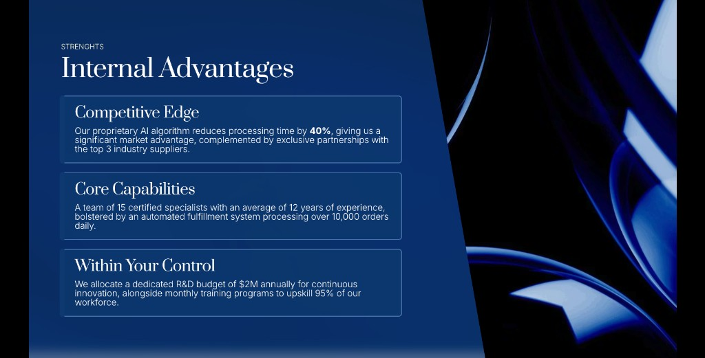

# API Overview

The Gamma API generates polished presentations, documents, websites, and social posts from text. Everything runs asynchronously: you create a generation, poll for status, and retrieve the result.

Use this page to decide which workflow fits your use case. When you need the exact request schema, field types, or response contract, switch to the API Reference tab.

## How it works



### Create a generation

`POST /v1.0/generations` with your content and parameters. You get back a `generationId`.



### Poll for status

`GET /v1.0/generations/{generationId}` every 5 seconds until `status` is `completed` or `failed`.



### Get your result

The completed response includes `gammaUrl` (view it in Gamma) and `exportUrl` (download as PDF, PPTX, or PNG).



See [Async Patterns and Polling](async-patterns-and-polling.md) for full implementation examples in Python, JavaScript, and cURL.

## Quick reference

- Use `POST /v1.0/generations` when you want Gamma to create the layout from your prompt and parameters.
- Use `POST /v1.0/generations/from-template` when you already have a Gamma template and want repeated outputs in the same structure.
- Poll `GET /v1.0/generations/{generationId}` until `status` is `completed` or `failed`.
- Use `GET /v1.0/themes` and `GET /v1.0/folders` to look up IDs before generation.

## Two ways to generate

| | Generate API | Create from Template API |
| --- | --- | --- |
| **Endpoint** | `POST /v1.0/generations` | `POST /v1.0/generations/from-template` |
| **When to use** | Creating from scratch. Maximum flexibility — you control format, tone, audience, images, layout, and more. | Producing variations of a consistent layout. Design the template once in the Gamma app, then generate new content into it. |
| **Required fields** | `inputText` + `textMode` | `prompt` + `gammaId` |
| **Key difference** | AI determines the layout based on your parameters. | Layout stays fixed to your template. Only the content changes. |

Both endpoints support `themeId`, `exportAs`, `sharingOptions`, and `folderIds`. See the full parameter reference for each:

- [Generate API Parameters](generate-api-parameters-explained.md)
- [Create from Template Parameters](create-from-template-api-parameters-explained.md)

## Key parameters at a glance

| Parameter | What it controls | Example values |
| --- | --- | --- |
| `format` | Output type | `presentation`, `document`, `webpage`, `social` |
| `textMode` | How input text is interpreted | `generate` (topic → content), `condense` (summarize), `preserve` (keep as-is) |
| `themeId` | Brand theme (colors, fonts, logo) | Get IDs from `GET /v1.0/themes` |
| `numCards` | Number of slides/sections | `1`–`75` depending on plan |
| `exportAs` | Auto-export on completion | `pdf`, `pptx`, `png` |
| `imageOptions.source` | Where images come from | `aiGenerated`, `webFreeToUseCommercially`, `noImages` |
| `textOptions.tone` | Writing style | Any string: `"professional"`, `"casual"`, `"academic"` |
| `textOptions.audience` | Who the content is for | Any string: `"executives"`, `"new hires"`, `"students"` |
| `cardOptions.headerFooter` | Logo, page numbers, text | 6 positions per card — see [Header and Footer Formatting](header-and-footer-formatting.md) |
| `sharingOptions` | Permissions on the generated gamma | Workspace, external link, and email access levels |



<div data-with-frame="true"><figure><figcaption><p>Theme and layout choices can shape a generation without changing the underlying workflow.</p></figcaption></figure></div>



<div data-with-frame="true"><figure><figcaption><p>Prompting, image settings, and export choices affect the final output you receive.</p></figcaption></figure></div>



## Supporting endpoints

| Endpoint | Purpose |
| --- | --- |
| `GET /v1.0/themes` | List available themes (standard + custom workspace themes). Use the `id` as `themeId`. |
| `GET /v1.0/folders` | List workspace folders. Use folder `id` values in `folderIds`. |
| `POST /v1.0/gammas/{gammaId}/archive` | Archive a gamma. Idempotent — archiving an already archived gamma succeeds. |

Both list endpoints use cursor-based pagination: check `hasMore`, pass `nextCursor` as the `after` query param.

## Authentication

All requests require an API key in the `X-API-KEY` header. Generate your key from [Account Settings > API Keys](https://gamma.app/settings/api-keys).

```bash
curl https://public-api.gamma.app/v1.0/themes \
  -H "X-API-KEY: $GAMMA_API_KEY"
```

API access requires a Pro, Ultra, Teams, or Business plan. See [Access and Pricing](access-and-pricing.md) for credit costs and plan details.


**Not a developer?** You can also use Gamma through [Connectors and Integrations](connectors-and-integrations.md) — Claude, Zapier, Make, and n8n. No code required.


## Related

- [Generate from text](generate-api-parameters-explained.md) for a parameter-by-parameter walkthrough of `POST /v1.0/generations`
- [Generate from a template](create-from-template-api-parameters-explained.md) for the fixed-layout workflow
- [Async Patterns and Polling](async-patterns-and-polling.md) for complete polling implementations
